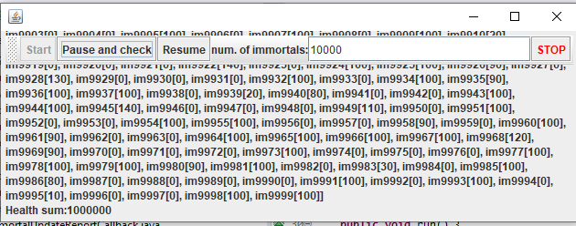

# Immortal Case

## Part I - Before finishing class
Thread control with wait/notify. Producer/consumer
1.	Check the operation of the program and run it. While this occurs, run jVisualVM and check the CPU consumption of the corresponding process. Why is this consumption? Which is the responsible class? 
	
	Se da este tipo de consumo porque el productor siempre espera cierto tienpo antes de producir, mientras que el consumidor siempre que la cola este llena consume.
	

2.	Make the necessary adjustments so that the solution uses the CPU more efficiently, taking into account that - for now - production is slow and consumption is fast. Verify with JVisualVM that the CPU consumption is reduced. 

Se decide que el consumidor esperara hasta que el productor agregue algo por medio de sincronizacion. 

Al ejecutarlo VisualVM nos muestra que ahora se esta haciendo uso de menos CPU.

3.	Make the producer now produce very fast, and the consumer consumes slow. Taking into account that the producer knows a Stock limit (how many elements he should have, at most in the queue), make that limit be respected. Review the API of the collection used as a queue to see how to ensure that this limit is not exceeded. Verify that, by setting a small limit for the 'stock', there is no high CPU consumption or errors.
	
	Hacemos el productor mas rapido que el consumidor
	
	
	
	Ponemos un limite de stock de 10
	
	
	
	La salida ahora luce asi
	
	
	
	
	El uso de CPU sigue siendo el mismo
	
	

## Part II
Synchronization and Dead-Locks.

1.	Review the “highlander-simulator” program, provided in the edu.eci.arsw.highlandersim package. This is a game in which:
	1.	You have N immortal players. 
	2.	Each player knows the remaining N-1 player.
	3.	Each player permanently attacks some other immortal. The one who first attacks subtracts M life points from his opponent, and increases his own life points by the same amount. 
	4.	The game could never have a single winner. Most likely, in the end there are only two left, fighting indefinitely by removing and adding life points. 
2.	Review the code and identify how the functionality indicated above was implemented. Given the intention of the game, an invariant should be that the sum of the life points of all players is always the same (of course, in an instant of time in which a time increase / reduction operation is not in process ). For this case, for N players, what should this value be?

	El valor del invariante siempre deberia ser la "DEFAULT_IMMORTAL_HEALTH" por el numero de inmortales.

3.	Run the application and verify how the ‘pause and check’ option works. Is the invariant fulfilled?

	La invariante no se cumple.
	
	
	
	
4.	A first hypothesis that the race condition for this function (pause and check) is presented is that the program consults the list whose values ​​it will print, while other threads modify their values. To correct this, do whatever is necessary so that, before printing the current results, all other threads are paused. Additionally, implement the ‘resume’ option.

	Para pausar el programa creamos una nueva variable a la clase principal llamada **Pausa** para que los hilos sepan si estan en pausa o no. Cuando se este en pausa cada hilo invocara un wait.
	
	

	Para renaudar el programa cambiamos la variable **Pausa** a falso y se le notifica a cada hilo.
	
	

5.	Check the operation again (click the button many times). Is the invariant fulfilled or not ?.

	La invariante sigue sin cumplirse.
	
	
	
	

6.	Identify possible critical regions in regards to the fight of the immortals. Implement a blocking strategy that avoids race conditions. Remember that if you need to use two or more ‘locks’ simultaneously, you can use nested synchronized blocks:

	Se identifica la zona critica en el momento en que dos inmortales pelean y uno le trata de quitar la salud a otro.
	
	

7.	After implementing your strategy, start running your program, and pay attention to whether it comes to a halt. If so, use the jps and jstack programs to identify why the program stopped.

	La invariante se mantiene pero ahora se presenta un deadlock y el programa se detiene sin siquiera pausarlo.
	
	

8.	Consider a strategy to correct the problem identified above (you can review pages 206 and 207 of Java Concurrency in Practice again).

	Se decide sincronizar los hilos por el orden en el que se encuentren.
	
	

9.	Once the problem is corrected, rectify that the program continues to function consistently when 100, 1000 or 10000 immortals are executed. If in these large cases the invariant begins to be breached again, you must analyze what was done in step 4.

	Con lo del punto anterior ya hecho, podemos probar que la invariante se sigue cumpliendo con 100 inmortales:
	
	
	
	
	Con 1000 inmortales:
	
	
	
	
	Con 10000 inmortales:
	
	
	

10.	An annoying element for the simulation is that at a certain point in it there are few living 'immortals' making failed fights with 'immortals' already dead. It is necessary to suppress the immortal dead of the simulation as they die. 
	1.	Analyzing the simulation operation scheme, could this create a race condition? Implement the functionality, run the simulation and see what problem arises when there are many 'immortals' in it. Write your conclusions about it in the file ANSWERS.txt. 
	2.	Correct the previous problem WITHOUT using synchronization, since making access to the shared list of immortals sequential would make simulation extremely slow. 
11.	To finish, implement the STOP option.
